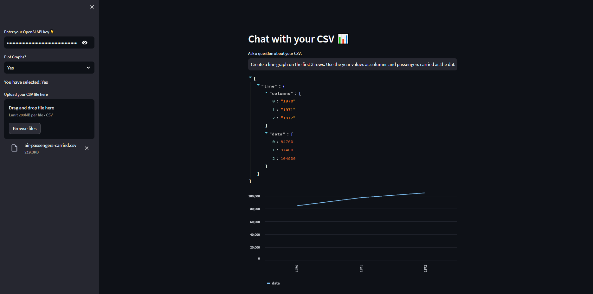

# CHAT-WITH-CSV

## How to use this repo and app 📚

- Clone this repository first.
- Then install all the necessary packages
  - `pip install langchain streamlit openai tabulate python-dotenv`
- After that run the web app with `streamlit run main.py` in terminal 🖥️.
- Get your [OpenAI](<[https://](https://openai.com/)>) API key from their website.
- Paste your OpenAI API key 🔑.
- Drag and Drop or browse your CSV file 📁.
- Now write your questions and get your answers.

## Website Preview

This is how the website would look like after running it for the first time.

This is how the website would look like after inserting your api key and the file.

This is hot the website will show if you want plot a bar graph.

This is hot the website will show if you want plot a line graph.

## END

If you face any issue feel free to contact me.
**Thank You**
